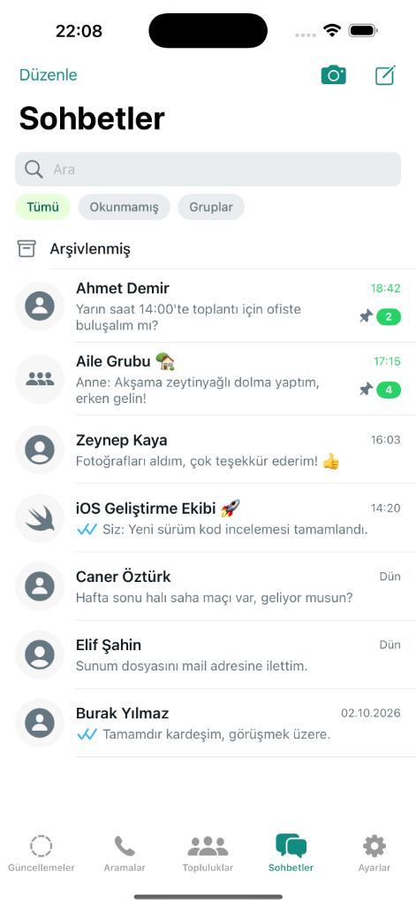
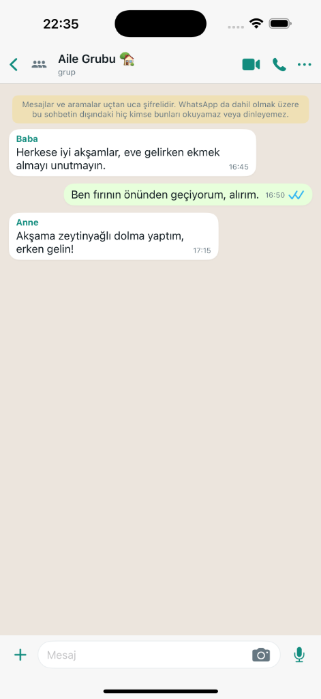
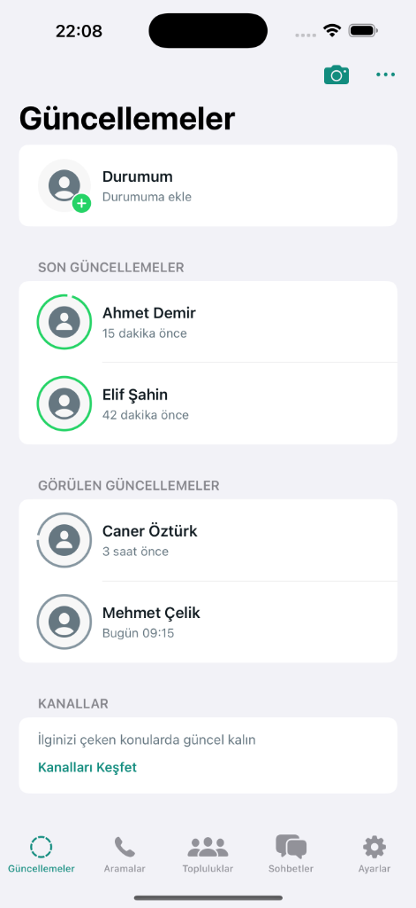
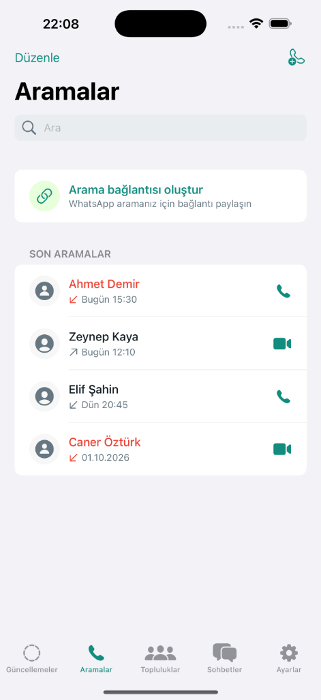
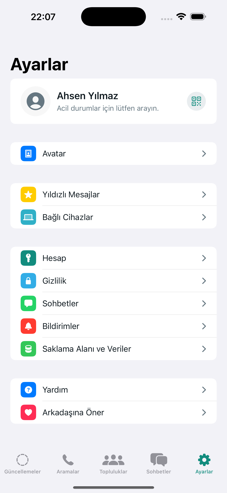

# WhatsApp iOS Clone (SwiftUI)

Modern **SwiftUI** ve **MVVM + Repository** mimarisi kullanılarak geliştirilmiş, %100 Türkçe WhatsApp iOS klonu.

---

## 📱 Uygulama Görselleri

| Sohbetler | Sohbet Detayı | Güncellemeler | Aramalar | Ayarlar |
|:---:|:---:|:---:|:---:|:---:|
|  |  |  |  |  |

---

## 📁 Klasör Yapısı

```text
WhatsAppClone/
├── WhatsAppCloneApp.swift                # Uygulama giriş noktası (@main)
├── Package.swift                         # SPM yapılandırması
├── Resources/
│   └── mock_data.json                    # Simüle edilmiş JSON veri kaynağı
├── Core/
│   ├── Constants/                        # AppConstants, AppStrings
│   ├── Theme/                            # AppColors, AppIcons
│   └── Extensions/                       # Color+Hex, RoundedCornerShape, View+Extensions
├── Models/                               # User, Message, Chat, StatusItem, CallLog vb.
├── Services/                             # JsonDataLoaderProtocol, LocalJsonService
├── Repositories/                         # WhatsAppRepositoryProtocol, WhatsAppRepository
├── ViewModels/                           # ChatList, ChatDetail, Status, Calls, Settings ViewModels
├── Views/
│   ├── Main/                            # MainTabView (5 Sekmeli TabBar)
│   ├── Chats/                           # ChatListView, ChatDetailView, MessageBubbleView vb.
│   ├── Status/                          # StatusListView, StatusRowView, ChannelsSectionView vb.
│   ├── Calls/                           # CallsListView, CallRowView, CreateCallLinkRowView
│   ├── Communities/                     # CommunitiesView, CommunityHeroView
│   ├── Settings/                        # SettingsView, SettingsRowView, ProfileHeaderCardView
│   └── Components/                      # Reusable bileşenler (Avatar, SearchBar, FilterChip vb.)
└── Screenshots/                         # Ekran görüntüleri
```

---

## 🛠 Mimari & Özellikler

* **MVVM + Repository**: UI, iş mantığı ve veri katmanı tamamen birbirinden izole edilmiştir.
* **Tek Dosya - Tek Tip**: Her Swift dosyasında yalnızca tek bir `class`, `struct`, `enum` veya `protocol` bulunur.
* **Sıfır Hardcode**: Renkler (`AppColors`), metinler (`AppStrings`), ikonlar (`AppIcons`) ve boyutlar (`AppConstants`) merkezi dosyalardan yönetilir.
* **Mock Servis Katmanı**: `LocalJsonService`, `mock_data.json` dosyasını asenkron olarak 200 ms ağ gecikmesi simülasyonuyla yükler.
* **Akıllı Mesaj Balonları**: Mesaj kartları ekranı kaplamaz; içeriğin uzunluğu kadar genişler.
* **Doğal Kaydırma**: Sohbet arama ve filtre çipleri liste ile birlikte yukarı kayarak kaybolur.

---

## 🚀 Projeyi Çalıştırma

Projeyi doğrudan Xcode ile açıp istediğiniz simülatörde çalıştırabilirsiniz:

```bash
open -a Xcode Package.swift
```
veya
```bash
swift run WhatsAppClone
```
